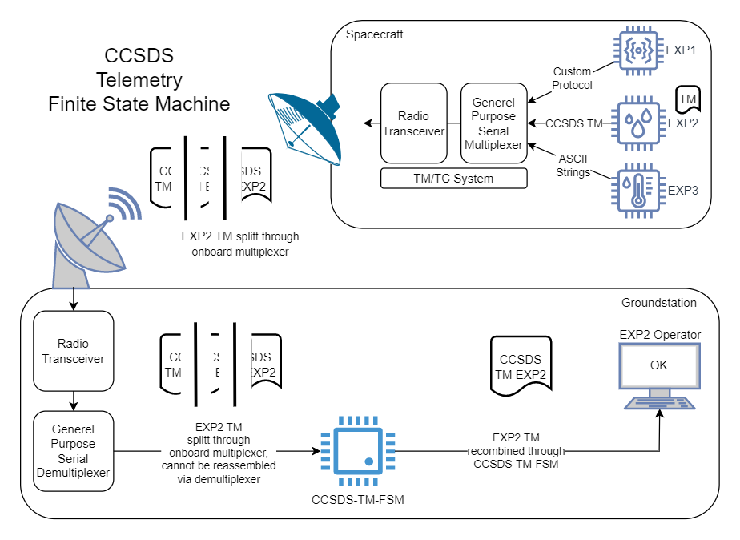
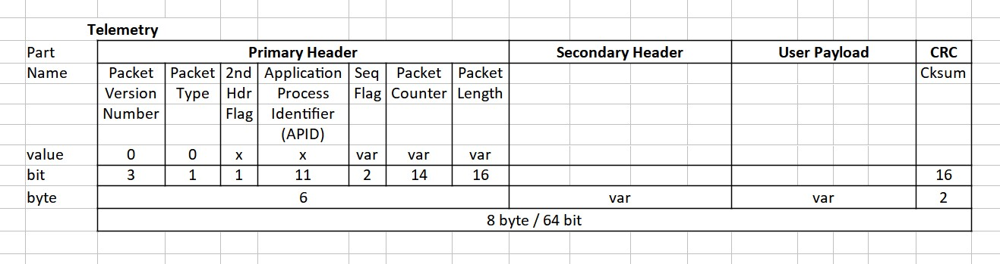

# CCSDS-TM-FSM

Finite State Machine for reassembly of CCSDS 133.0-B-2 Space Packet Protocol Telemetry messages.

This project was implemented in [RT-Thread OS](https://www.rt-thread.io/) on [NXP i.MX RT1060](https://www.nxp.com/design/development-boards/i-mx-evaluation-and-development-boards/i-mx-rt1060-evaluation-kit:MIMXRT1060-EVKB) as part of the [RT-Thread 2023 IoT Contest](https://rt-thread.medium.com/announcing-the-2023-iot-contest-entries-a54eb151a48d) by Nico Maas, 2023

## Overview

As part of proven flight heritage, numerous spacecraft employ (asynchronous) serial interfaces like RS-422 to connect subsystems or experiments to the Telemetry/Telecommand system.

To allow the multitude of systems to communicate with the ground using the often singular up-/downlink, multiplexers are used.

There are different kinds of possibilities to implement multiplexers: A specialized approach and a generalist one.

The specialized approach means that the multiplexer will understand the protocols used by the different kinds of attached subsystems. It is hence able to understand when a new message begins and ends and can therefore transmit complete messages/packets. This however comes with the drawbacks that such a multiplexer is more complex to build, needs more compute resources and will introduce overhead.

The generalist approach multiplexer will receive data from all attached sources, not knowing what the content or length of the messages are wait until it has either received enough data for its buffers to be full - or a timeout has occurred - and send this mixed buffer back to ground. While this generalist approach seems less elegant, it has the advantage to appear as a truly transparent link between space and ground, allowing every kind of experiments to be attached without further adaptation.

The drawback of this method is that messages will be cut into parts which cannot be re-assembled by the demultiplexes on ground into their original "complete" message. Instead, multiple message parts will be sent to the experiment operator computer.

Providing the onboard experiment uses CCSDS Space Packet telemetry, this project creates a small device which can receive split message parts via UDP, reassemble those to a complete message and forwards them to the experiment operator computer.

Additionally, having the message reassembled on the NXP processor allows to employ HSW (hardware security modules) to perform secure cryptographic functions outside of the less secure context of a default Windows/Linux/Mac OS computer.



The figure shows the data flow from our fictive experiment 2 on the spacecraft to the ground.

## Requirements

- NXP i.MX RT1060 EVKB / MIMXRT1060-EVKB
- RT-Thread Studio 2.2.6
  - PyOCD 0.2.0
  - GNU_Tools_for_ARM_Embedded 10.2.1
- env Tools
- RT-Thread OS 5.0.1 with latest RT1060-EVK BSP ( https://github.com/RT-Thread/rt-thread/tree/master/bsp/imxrt/imxrt1060-nxp-evk )

## Installation

- Main RT-Thread Github Page for the NXP i.MX RT1060: https://github.com/RT-Thread/rt-thread/tree/master/bsp/imxrt/imxrt1060-nxp-evk
- If not yet done, download and install Git
- RT-Thread Studio: https://www.rt-thread.io/studio.html
  - Just download and install (e.g. D:\RT-ThreadStudio)
- envTool: https://github.com/RT-Thread/env-windows/releases
  - Pick the latest env-windows-v*.7z and download
  - Unzip the included folder (e.g. D:\RT-ThreadStudioEnv\env-windows-v1.3.5)
  - Start env.exe
  - Click on the Hamburger Menu, Settings, Integration
  - Click on "Register" and "Save settings", close the settings menu and the envTool
  - More detailed info for the envTool can be found: https://github.com/RT-Thread/rt-thread/blob/master/documentation/env/env.md
- RT-Thread Github Repo: https://github.com/RT-Thread/rt-thread
  - Clone the repo ( ``git clone https://github.com/RT-Thread/rt-thread.git`` ) to your system, (e.g. to D:\RT-ThreadGithub)
- Preparation
  - Navigate to the BSP folder example for the imxrt1060-nxp-evk (e.g. D:\RT-ThreadGithub\rt-thread\bsp\imxrt\imxrt1060-nxp-evk)
  - Right-click within the folder and click ConEmu here
  - Within the opened envTools, start ````menuconfig````
  - Navigate to "Hardware Drivers Config", "Onboard Peripheral Drivers" and Enable Ethernet. Leave this submenu until you're back at the root of the menuconfig. Enter "RT-Thread Components", "Network", "LwIP" and choose "lwIP version". Choose the most current, non-latest version (e.g. 2.1.2). Enter Exit menuconfig and write the new config.
  - Add the ccsds-tm-fsm.c and main.c file from this repo into the D:\RT-ThreadGithub\rt-thread\bsp\imxrt\imxrt1060-nxp-evk\applications folder.
- Generate RT-Thread project
  - Start RT-Thread Studio
  - File -> Import -> RT-Thread Bsp Project into Workspace
    - Bsp Location (within the Github Repo): D:\RT-ThreadGithub\rt-thread\bsp\imxrt\imxrt1060-nxp-evk
    - Project Name: CCSDS-TM-FSM
    - Chip Name: MIMXRT1060
    - Debugger: DAP-LINK
    - click finish
  - This will lead to an error, pointing you to the workspace folder ( e.g. mine is D:\RT-ThreadStudio\workspace\.metadata ) where a .log file resides. Open it up and scroll to the end. At this time in the development, there seems to be an error with the initial compilation shown with this error: ````"!MESSAGE D:\RT-ThreadGithub\rt-thread\bsp\imxrt\imxrt1060-nxp-evk>scons --dist-ide --project-path=D:\RT-ThreadStudio\workspace/CCSDS-TM-FSM --project-name=CCSDS-TM-FSM"````. To fix this issue, navigate with the windows explorer to the folder ````D:\RT-ThreadGithub\rt-thread\bsp\imxrt\imxrt1060-nxp-evk````. Within the folder, hold shift and right-click and choose ````ConEmu Here```` - the envTools will open up. Just copy and paste the complete scons command (````scons --dist-ide --project-path=D:\RT-ThreadStudio\workspace/CCSDS-TM-FSM --project-name=CCSDS-TM-FSM````) into the envTools window and press enter. It should compile now.
    ````
    user@system D:\RT-ThreadGithub\rt-thread\bsp\imxrt\imxrt1060-nxp-evk
    > scons --dist-ide --project-path=D:\RT-ThreadStudio\workspace/CCSDS-TM-FSM --project-name=CCSDS-TM-FSM
    scons: Reading SConscript files ...
    Newlib version: 4.1.0
    make distribution....
    => imxrt1060-nxp-evk
    => start dist handle
    => copy imxrt bsp library
    => copy bsp drivers
    => copy bsp peripherals
    => components
    => include
    => libcpu
    => src
    => tools
    Update configuration files...
    suggest to use command scons --dist [--target=xxx] [--project-name=xxx] [--project-path=xxx]
    dist project successfully!
    ````

    After this step, click finish in the still open import menu in RT-Thread Studio again, it should work now and generate the new project.
  - Directly next to the "Flash Download" icon is the "SDK Manager", open it up and scroll down to the "Debugger_Support_Packages", "PyOCD". Choose the latest version (e.g. 0.2.0) and click on "Install packages". You can then select the old version(s) you have installed and click on "Delete packages". Also go to "ToolChain_Support_Packages", "GNU_Tools_for_ARM_Embedded" and install the latest version (e.g. 10.2.1). Afterwards also delete the old version. Close the SDK Manager.
  - Click on the hammer icon ("Build 'Debug'") and it should compile the new software.
  - Click on the downward green arrow ("Flash Download") to download the program to the hardware board. The User LED should now be flashing.
  - There can be multiple issues at Download:
    - A window with "J-Link Emulator selection" pops up and asks for connection methods. This error means that RT-Thread Studio tries to program via Segger Link, which is the incorrect flash tool for the EVKB. If this comes up, please click no on the J-Link screen. Then check on the little black arrow attached to the Flash Download icon, that "DAP-LINK" is checked. Afterwards try Downloading again.
    - "pyocd.core.exceptions.TargetSupportError: Target type 'mimxrt1060' not recognized." If this error arises it can mean two things:
      - You did not enter the Chip Name correctly. Please check that the error is really mimxrt1060 - and no spelling issues are there. If there are, go to the Cogwheel Icon ("Debug configuration"), Debugger tab and correct the Chip Name within the Device name area. Click Ok to save and try again.
      - Scroll up through the error list and you might see the path of the pyocd software, e.g. ````RealThread\PyOCD\0.1.3```` - this would mean you're running the default PyOCD 0.1.3 - which has some errors that will mean you cannot download to flash. Directly next to the "Flash Download" icon is the "SDK Manager", open it up and scroll down to the "Debugger_Support_Packages", "PyOCD". Choose the latest version (e.g. 0.2.0) and click on "Install packages". You can then select the old version(s) you have installed and click on "Delete packages". Afterwards close the SDK Manager. This should fix the issue.
  - If there are no issues with the Download, can you also "Open a Terminal" (computer screen icon close to "Flash Download"). And start with the correct settings (e.g. 115200 BAUD and the correct Serial port, should be chosen automatically if you already flashed a program before). You should see the RT msh console running on your EVKB and be able to send a "help" to get an overview over the device

## Configuration



The configuration starts with setting the correct items:

- CCSDS configuration
  - PACKET_VERSION_NUMBER: Match the version of the packets you want to receive (default 0)
  - PACKET_TYPE: We are awaiting telemetry packets, which would default to 0
  - APID_CONFIG: This contains tuples of the APID ID and a boolean value if said APID has a second header implemented or not
- Network configuration
  - If you want the NXP board to use DHCP to set its own IP address, leave the SERVER_IP_ADDR, SERVER_NETMASK and SERVER_GATEWAY_IP undefinied / commented out. If you want to set these addresses manually, comment them in and set the appropriate values.
  - SERVER_UDP_PORT is going to be the port the NXP board is going to wait for new TM packages coming from space
  - DEST_IP_ADDR is going to be the IP Address the board is forwarding re-assembled Space Packets to
  - DEST_UDP_PORT is the UDP Port used to forward the Space Packets to

## How it works

- Upon boot, ````app_thread_create```` configures the network interface, generates incoming and outgoing message queues and generates/starts the udp_server and state_machine threads
- The udp_server thread
  - receives new packets
  - splits them into single bytes
  - sends them to the incoming queue
- The state machine thread
  - generates SYNCWORDs out of the CCSDS configuration items 
  - receives new bytes via the incoming queue
  - (Mode 0) It then reads the first 2 bytes, compares them to the SYNCWORDs generated. SYNCWORDS are the byte configuration consisting of the Packet Version, Packet Type, 2nd Header and APID information. If at some point these values match - the start of a new packet is found. The data is added to the outgoing queue, FSM moves to Mode 2
  - (Mode 2) the next 2 bytes are read and added to the outgoing queue (Sequene Flag and Sequence Count), FSM moves to Mode 21
  - (Mode 21) the next 2 bytes are read (Packet Length) and added to the outgoing queue - now it is known how long the user data is going to be, FSM moves to Mode 22
  - (Mode 22) the amount of needed packets according to Packet Length is read and added to the outgoing queue, FSM moves to Mode 23
  - (Mode 23) the last 2 bytes are read (CRC information), all data is copied to a byte array and the CRC information is computed and compared to the one sent via the message itself. If its identical, the re-assembly of the packet was successful and its sent via UDP to the target system. If not, all data is deleted. In any way FSM moves to Mode 0 and restarts

## Disclaimer / Transparency

As part of the RT-Thread 2023 IoT Contest, RT-Thread/NXP me with one NXP i.MX RT1060 EVKB at no additional charge to make this project possible.
